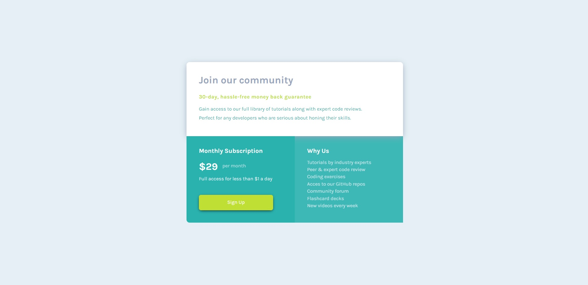

- Overview:
  - [Single Price Grid Component](#the-challenge)
  - [https://wella4life.github.io/Challenge_8_Easy/](#links)
  - 

 - Users should be able to:
   - View the optimal layout for the site depending on their device's screen size
   - Hover stats on "Sign Up" button

 - What I Learned:
   - Box shadowing is amazing and very hard to master
   - Using :after with :after:hover can seperate the background from the content
   - Using opacity on only the background helped quite a lot
   - in-boxing everything helps when thinking of padding the content to fit
   - wait for the github website to load before posting solution
 
 - What I Couldn't Do:
   - Mobile Version would take time and I am lazy but its easy to do
   - Couldn't use Z-indexing efficiently and so the shadow from the top box appears above the background of the right small box
   - Size differences again
